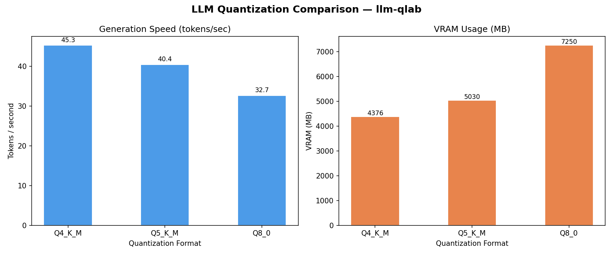

# llm-qlab

> **LLM Quantization Benchmarks on Consumer GPUs**


A collection of Python scripts for benchmarking quantized large language models (LLMs) on consumer-grade NVIDIA GPUs. Track inference speed, VRAM usage, and quality trade-offs across different quantization formats.

---

## 🖥️ Hardware & Environment

| Component | Details |
|-----------|------|
| **GPU** | NVIDIA RTX 5070 Laptop GPU, 8 GB VRAM (compute capability 12.0) |
| **CUDA** | 13.2 |
| **Driver** | 595.97 |
| **OS** | Windows 11 (native) |
| **Python** | 3.14.3 |
| **llama-cpp-python** | 0.3.20 (built from source) |

---

## 📊 What This Repo Tracks

Benchmarks comparing the following quantization formats using **llama-cpp-python** (GGUF inference via llama.cpp, CUDA-accelerated):

| Format | Description |
|--------|-------------|
| `Q4_K_M` | 4-bit K-quant (medium) — best speed, lowest VRAM |
| `Q5_K_M` | 5-bit K-quant (medium) — balance of speed and quality |
| `Q8_0` | 8-bit quantization — near-FP16 quality, highest VRAM |

Metrics captured per run:
- Tokens / second (prompt processing & generation)
- VRAM usage (MB)
- Model load time (seconds)
- Model file size (MB)

---

## 🚀 Quick Start

### 1. Clone & install dependencies

```bash
git clone https://github.com/iarjunganesh/llm-qlab
cd llm-qlab
pip install -r requirements.txt
```

> **Note — llama-cpp-python source build required for CUDA 13.2 / sm_120 (RTX 5070 series):**
> The PyPI wheel does not include sm_120 CUDA kernels. Build from source:
> ```bash
> git clone https://github.com/abetlen/llama-cpp-python --recursive
> cd llama-cpp-python
> set GGML_CUDA=on
> set FORCE_CMAKE=1
> pip install .
> ```
> After building, install remaining deps from the repo root: `pip install -r requirements.txt`

### 2. Download GGUF models from Hugging Face

Use the bundled `download_model.py` helper:

```bash
# List available presets
python download_model.py --list

# Download Llama-2-7B-Chat Q4_K_M (3.9 GB)
python download_model.py --model llama2-7b

# Download Q5_K_M (4.6 GB) or Q8_0 (6.8 GB)
python download_model.py --model TheBloke/Llama-2-7B-chat-GGUF --filename llama-2-7b-chat.Q5_K_M.gguf
python download_model.py --model TheBloke/Llama-2-7B-chat-GGUF --filename llama-2-7b-chat.Q8_0.gguf
```

Or use the Hugging Face CLI directly:

```bash
huggingface-cli download TheBloke/Llama-2-7B-chat-GGUF llama-2-7b-chat.Q4_K_M.gguf --local-dir ./models
```

### 3. Run a benchmark

```bash
python benchmark.py --model models/llama-2-7b-chat.Q4_K_M.gguf --quant-type Q4_K_M --n-gpu-layers 99
```

Run all three quantization levels:

```bash
python benchmark.py --model models/llama-2-7b-chat.Q4_K_M.gguf --quant-type Q4_K_M --n-gpu-layers 99
python benchmark.py --model models/llama-2-7b-chat.Q5_K_M.gguf --quant-type Q5_K_M --n-gpu-layers 99
python benchmark.py --model models/llama-2-7b-chat.Q8_0.gguf   --quant-type Q8_0   --n-gpu-layers 99
```

### 4. Monitor GPU in a separate terminal

```bash
python monitor_gpu.py --interval 1
```

### 5. Compare quantization results

```bash
python compare_quants.py
```

---

## 🔧 Script Reference

| Script | Purpose | Key Args |
|--------|---------|----------|
| `benchmark.py` | Run inference benchmark | `--model`, `--quant-type`, `--model-family`, `--n-predict`, `--n-gpu-layers`, `--prompt` |
| `compare_quants.py` | Plot & compare results | `--group-by` (`quant_type` \| `model_family`); reads `results/benchmark_results.csv` |
| `offload_ladder.py` | Sweep n_gpu_layers and plot VRAM vs speed | `--model`, `--quant-type`, `--steps` |
| `monitor_gpu.py` | Live GPU stats logger | `--interval`, `--output` |
| `download_model.py` | Download GGUF models | `--model`, `--filename`, `--list` |

---

## 🆕 New Features

### ⏱️ TTFT — Time-to-First-Token

`benchmark.py` now captures **time-to-first-token (TTFT)** in milliseconds alongside throughput metrics. TTFT is measured as the wall-clock time from the start of inference until the first generated chunk arrives, using llama-cpp-python's streaming API.

The value is included in the CSV output (`ttft_ms` column) and printed in the benchmark summary:

```
  TTFT (ms)        : 42.17
```

### 📉 GPU Offload Ladder

`offload_ladder.py` systematically varies `--n-gpu-layers` across a configurable set of steps, benchmarks the model at each level, and produces:

- A summary table printed to stdout
- `results/offload_ladder.csv` with per-step metrics
- `results/offload_ladder.png` — dual-axis line plot (gen t/s vs. VRAM MB)

```bash
python offload_ladder.py --model models/llama-2-7b-chat.Q4_K_M.gguf --quant-type Q4_K_M
python offload_ladder.py --model models/llama-2-7b-chat.Q4_K_M.gguf --quant-type Q4_K_M --steps 0,16,32,99
```

### 🏷️ Multi-Model Family Support

`benchmark.py` now accepts a `--model-family` flag to tag results with the model family (e.g. `llama2`, `mistral`, `phi3`, `gemma`):

```bash
python benchmark.py --model models/mistral-7b-instruct.Q4_K_M.gguf --quant-type Q4_K_M --model-family mistral
python benchmark.py --model models/llama-2-7b-chat.Q4_K_M.gguf     --quant-type Q4_K_M --model-family llama2
```

`compare_quants.py` gains a `--group-by` argument. When set to `model_family`, it generates a grouped bar chart saved to `results/comparison_by_family.png` and prints a markdown table grouped by model family:

```bash
python compare_quants.py --group-by model_family
```

> **Backward compatibility:** old CSV files without `model_family` or `ttft_ms` columns are handled gracefully — missing values are filled with `"unknown"` and `-1` respectively.

---


**Hardware:** NVIDIA RTX 5070 Laptop GPU (8 GB VRAM) · CUDA 13.2 · Driver 595.97  
**Backend:** llama-cpp-python 0.3.20, built from source · Full GPU offload (`--n-gpu-layers 99`)  
**Prompt:** 113 tokens · **Generated:** 128 tokens



| Model | Quant | Gen (t/s) | Prompt (t/s) | VRAM (MB) | Load (s) | Size (MB) |
|-------|-------|-----------|--------------|-----------|----------|-----------|
| Llama-2-7B-Chat | Q4_K_M | 45.27 | 39.97 | 4376 | 6.01 | 3892 |
| Llama-2-7B-Chat | Q5_K_M | 40.41 | 35.68 | 5030 | 3.45 | 4562 |
| Llama-2-7B-Chat | Q8_0 | 32.67 | 28.84 | 7250 | 7.36 | 6829 |

> VRAM headroom on 8 GB: Q4 leaves ~3.7 GB free, Q5 ~3.1 GB, Q8 only ~0.9 GB. Keep headroom for KV cache.

---

## 📁 Repository Structure

```
llm-qlab/
├── README.md
├── requirements.txt
├── benchmark.py          # Main benchmark runner
├── compare_quants.py     # Comparison plots & table
├── offload_ladder.py     # GPU offload ladder sweep
├── monitor_gpu.py        # Live GPU monitor
├── download_model.py     # GGUF model downloader
├── .gitignore
└── results/
    ├── benchmark_results.csv       # Benchmark output (ignored by git)
    ├── offload_ladder.csv          # Offload ladder output (ignored by git)
    ├── comparison.png              # Generated chart
    ├── comparison_by_family.png    # Family comparison chart (generated)
    └── offload_ladder.png          # Offload ladder plot (generated)
```

---

## 🤝 Contributing

PRs and issues welcome! If you have results from other GPUs or models, feel free to open a PR with your data.

---

## 📄 License

MIT
